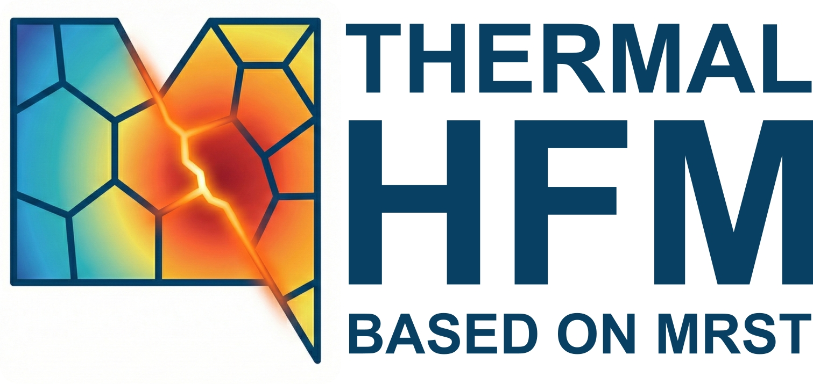

<p align="center">
  
</p>

# thermal-hfm

[](https://doi.org/10.5281/zenodo.22094685)

Coupled flow and heat transport through fractured reservoirs in the
[MATLAB Reservoir Simulation Toolbox (MRST)](https://www.sintef.no/projectweb/mrst/),
using the Embedded Discrete Fracture Model (EDFM) and its projection-based
extension (pEDFM).

`thermal-hfm` is a third-party MRST module. It bridges MRST's `geothermal` and
`hfm`/`shale` modules: `geothermal` supplies the energy balance and thermal
rock and fluid properties, `hfm`/`shale` supply the embedded-fracture grid,
intersection geometry and Non-Neighbouring Connections (NNCs). This module adds
the thermal NNC transmissibilities, a single EDFM/pEDFM-aware model class, and
the state functions that handle the extended connectivity (regular faces plus
NNCs) that fractured grids require.

## Features

- **One model class for both methods.** `GeothermalHFMModel` covers EDFM and
  pEDFM; its `fractureMethod` property (`'auto'`, `'edfm'`, `'pedfm'`) selects
  the operator builder. `'auto'` detects pEDFM from the grid, namely whether
  the projection preprocessing left `G.nnc.pMMneighs`.
- **Thermal NNC transmissibilities.** `computeThermalNNCTransFracMatrix` and
  `computeThermalNNCTransFracFrac` produce the rock and fluid heat NNC
  transmissibilities for the 3D and 2D pipelines.
- **Conduction and diffusion follow the flow connectivity.** The pEDFM
  area-reduction multiplier is applied to conductive heat and molecular
  diffusion exactly as it is to fluid flow, following HosseiniMehr et al.
  (2022), so a flow barrier still conducts heat as it should physically.
- **Dynamic (state-dependent) transmissibilities.** Thermal conductivities may
  be given as scalars, per-cell vectors, or `@(T)` / `@(p,T)` function handles;
  the handle forms activate the dynamic state functions.
- **Single-phase water and H2O + NaCl brine**, with the Spivey EOS for
  temperature- and pressure-dependent density and viscosity.
- **2D and 3D pipelines**, including projection-based (pEDFM) connections.

## Requirements

- MRST **2026a** or later
- Required MRST modules: `hfm`, `geothermal`, `compositional`, plus the usual
  `ad-core`, `ad-props`
- Optional: `shale` (needed for pEDFM), `dfm` (needed only by the
  DFM-vs-EDFM comparison example)

## Installation

The module belongs in MRST's `solvers/` directory, alongside `hfm` itself.
Either clone it directly:

```bash
git clone https://github.com/MuPhiResearch/thermal-hfm.git /path/to/mrst/solvers/thermal-hfm
```

or, if you keep MRST in git, add it as a submodule:

```bash
git submodule add https://github.com/MuPhiResearch/thermal-hfm.git solvers/thermal-hfm
```

MRST discovers modules under `solvers/` automatically. If yours lives
elsewhere, register it once per session with:

```matlab
mrstPath('register', 'thermal-hfm', '/path/to/thermal-hfm')
```

Then load it like any other module:

```matlab
mrstModule add hfm geothermal thermal-hfm
```

## Quick start

```matlab
mrstModule add hfm geothermal thermal-hfm ad-core ad-props

% 1. matrix grid + fractures, embedded into the global grid
%    2D: processFracture2D -> CIcalculator2D -> gridFracture2D
%    3D: EDFMshalegrid or preProcessingFractures -> assembleGlobalGrid

% 2. flow NNCs
%    2D: defineNNCandTrans
%    3D: fracturematrixShaleNNC3D -> fracturefractureShaleNNCs3D
%    pEDFM additionally: pMatFracNNCs3D

% 3. thermal properties (stock geothermal functions)
G.rock = addThermalRockProps(G.rock, 'lambdaR', 2.0, 'rhoR', 2700, 'CpR', 880);
rock   = G.rock;
fluid  = addThermalFluidProps(fluid, 'Cp', 4200, 'lambdaF', 0.6, 'useEOS', true);

% 4. thermal NNC transmissibilities
G = computeThermalNNCTransFracMatrix(G, rock, fluid);

% 5. model ('auto' picks pEDFM when the grid carries the projection data)
model = GeothermalHFMModel(G, rock, fluid, 'fractureMethod', 'auto');

% 6. wells, schedule, initial state, then
[wellSols, states] = simulateScheduleAD(state0, model, schedule);
```

Each step is described in detail in the
[documentation](https://muphiresearch.github.io/thermal-hfm/).

## Examples

Runnable scripts in [`examples/`](examples), each self-contained:

| Script | What it shows |
|---|---|
| `example_2d_thermal_edfm.m` | Two intersecting fractures in 2D; hot-water injection and thermal breakthrough |
| `example_3d_thermal_edfm.m` | Single vertical fracture plane via the 3D `hfm` pipeline |
| `example_dfm_vs_edfm_comparison.m` | Fully resolved DFM (unstructured Delaunay) vs EDFM on the same problem |
| `example_edfm_vs_pedfm_2d.m` | EDFM vs pEDFM in 2D with a barrier and a conduit fracture |
| `example_edfm_vs_pedfm_3d.m` | The same comparison in 3D |
| `example_edfm_brine_eos.m` | H2O + NaCl brine with the Spivey EOS and dynamic fluid conductivity |
| `example_pedfm_brine_eos.m` | The brine case under pEDFM |
| `example_thermal_doublet.m` | 20-year geothermal doublet in a heterogeneous 3D reservoir with two barriers and two conduits |

## Repository layout

```
models/           GeothermalHFMModel — the EDFM/pEDFM-aware geothermal model
preprocessing/    thermal NNC transmissibilities (frac-matrix, frac-frac)
statefunctions/   dynamic flow, heat and molecular transmissibilities
examples/         runnable example scripts
private/          module loader (modload)
docs/             Sphinx documentation source
```

## Documentation

Full documentation, including the governing equations, the EDFM and pEDFM
formulations, and a reference for every function and state function:

**https://muphiresearch.github.io/thermal-hfm/**

## References

- Lee, S.H., Lough, M.F., Jensen, C.L. (2001). Hierarchical modeling of flow in
  naturally fractured formations with multiple length scales. *Water Resources
  Research*, 37(3), 443–455.
- Moinfar, A., Varavei, A., Sepehrnoori, K., Johns, R.T. (2014). Development of
  an efficient embedded discrete fracture model for 3D compositional reservoir
  simulation in fractured reservoirs. *SPE Journal*, 19(2), 289–303.
- Ţene, M., Bosma, S.B.M., Al Kobaisi, M.S., Hajibeygi, H. (2017).
  Projection-based Embedded Discrete Fracture Model (pEDFM). *Advances in Water
  Resources*, 105, 205–216.
- HosseiniMehr, M., Piguave Tomala, J., Vuik, C., Al Kobaisi, M., Hajibeygi, H.
  (2022). Projection-based embedded discrete fracture model (pEDFM) for flow
  and heat transfer in real-field geological formations with corner-point
  grids. *Advances in Water Resources*, 159, 104091.

## Citation

If you use thermal-hfm in your work, please cite it via its DOI:

> Najafi-Silab, R., Egya, D., Doster, F., Menke, H., & Maes, J. (2026).
> *thermal-hfm: coupled flow and heat transport through embedded discrete
> fractures in MRST*. Zenodo.
> https://doi.org/10.5281/zenodo.22094685

That DOI always resolves to the newest release; the DOI for v1.0.0
specifically is [10.5281/zenodo.22094686](https://doi.org/10.5281/zenodo.22094686).
Machine-readable metadata is in [CITATION.cff](CITATION.cff), which GitHub
exposes through the "Cite this repository" button.

## License

GPL-3.0, matching MRST. See [LICENSE](LICENSE).
